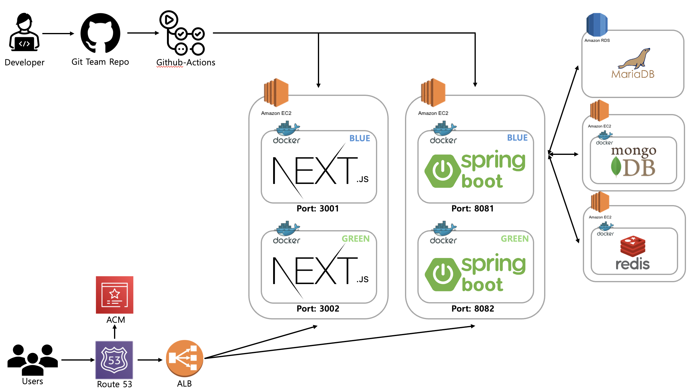
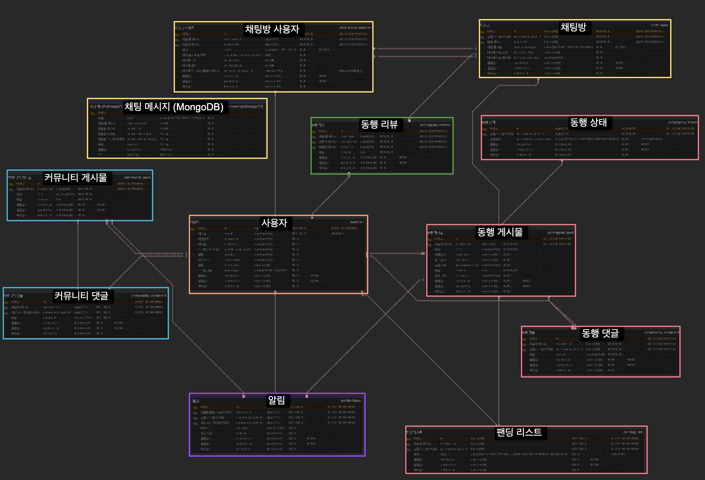

# ark - 커넥트립

## 팀원

|  |  |  |  |
|:-------------------------------------------------:|:------------------------------------------------:|:-----------------------------------------------:|:-------------------------------------------------:|
|                   eric.ha (하남규)                   |                  noah.jo (조태현)                   |                 paz.kang (강지훈)                  |                  true.choi (최진실)                  |
|                     @Namgyu11                     |                   @49EHyeon42                    |                   @TopazKang                    |                      @trueS2                      |

## 기술 스택

### Back

    
    

    
    
    

    
    
    

    
    

### Database

### Deploy & Infra

## 배포 아키텍처

## ERD

## 구현

### 사용자

- Spring Securiry, 카카오 OAuth2 그리고 JWT를 사용한 로그인 및 인증/인가
- 프로필
    - 프로필 조회
    - 프로필 수정

### 동행 게시물

- JPA를 기반으로 동행 게시물 목록, 페이지네이션 구현
- 페이지네이션을 통한 동행 게시물 목록 조회
- 제목 또는 내용을 통한 동행 게시물 목록 검색
- 동행 게시물 상세 조회, 수정 및 삭제
- 단축 URL 및 QR 코드를 통한 공유 기능
- 동행 모집 상태
    - 동행 모집
    - 동행 모집 마감
    - 동행 종료
- 동행 요청 상태
    - 동행 게시물을 통한 동행 신청
    - 신청한 동행 요청 취소
    - 신청 받은 동행 요청 승인
    - 신청 받은 동행 요청 거절

### 동행 게시물 댓글

- 댓글 조회
- 댓글 작성, 수정 및 삭제

### 실시간 채팅 & 위치 공유

- Websocket과 redis 그리고 MongoDB 활용한 채팅 구현
    - QueryDsl로 채팅 목록 구현
    - 채팅 메시지 인피니티 스크롤 구현
- GeoLocation을 바탕으로 위치 공유 API
    - 채팅 방 내 위치 공유 유무 설정 가능
    - 채팅 방 내 사용자의 마지막 위치 조회 및 수정

### 동행 후기

- 동행 완료 후 다른 동행자의 후기 작성
- 동행 후기 조회 기능

### 커뮤니티 게시물

- JPA를 기반으로 동행 게시물 목록, 페이지네이션 구현
- 제목 또는 내용을 통한 동행 게시물 목록 검색
- 동행 게시물 상세 조회, 수정 및 삭제
- 단축 URL 및 QR 코드를 통한 공유 기능

### 커뮤니티 게시물 댓글

- 댓글 조회
- 댓글 작성, 수정 및 삭제

### 알림

- Websocket을 통한 채팅 알림 구현
- SSE를 통한 게시글 댓글 알림 구현

### Rate Limiting

- Token Bucket 알고리즘을 구현한 Bucket4j를 사용하여 Rate Limiting 적용

    

        <h2>API 명세서</h2>
    

    

        
    
    

